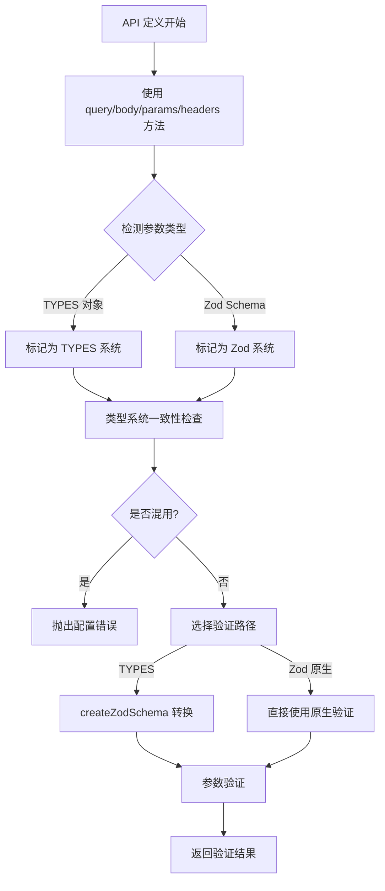

# Node-ERest 原生 Zod 类型支持需求文档

## 1. 产品概述

为 Node-ERest 框架增加原生 Zod 类型声明支持，在保持现有 TYPES 系统兼容性的同时，提供更高性能的类型验证方案。确保在同一个 API 定义中两种类型系统不能混用，提升开发体验和运行时性能。

## 2. 核心功能

### 2.1 用户角色

| 角色      | 使用场景          | 核心权限                     |
| ------- | ------------- | ------------------------ |
| API 开发者 | 使用框架定义 API 接口 | 可选择使用 TYPES 或原生 Zod 类型定义 |
| 框架维护者   | 维护和扩展框架功能     | 管理类型系统兼容性和性能优化           |

### 2.2 功能模块

本需求包含以下主要功能模块：

1. **原生 Zod 类型支持模块**：支持直接使用 zod schema 定义 API 参数
2. **类型系统隔离模块**：确保 TYPES 和 Zod 类型不能在同一 API 中混用
3. **性能优化模块**：提升 Zod 原生类型的验证性能
4. **测试覆盖模块**：完整的测试用例覆盖新功能

### 2.3 页面详情

| 模块名称          | 功能名称          | 功能描述                                              |
| ------------- | ------------- | ------------------------------------------------- |
| 原生 Zod 类型支持模块 | Zod Schema 定义 | 支持在 API 定义中直接使用 z.object(), z.string() 等原生 zod 类型 |
| 原生 Zod 类型支持模块 | 类型推导增强        | 提供完整的 TypeScript 类型推导支持                           |
| 原生 Zod 类型支持模块 | 验证性能优化        | 跳过 TYPES 到 Zod 的转换过程，直接使用原生验证                     |
| 类型系统隔离模块      | 混用检测          | 在 API 初始化时检测并阻止 TYPES 和 Zod 类型混用                  |
| 类型系统隔离模块      | 错误提示          | 提供清晰的错误信息指导开发者正确使用                                |
| 性能优化模块        | 直接验证          | 原生 Zod 类型跳过 createZodSchema 转换过程                  |
| 性能优化模块        | 缓存机制          | 缓存编译后的 schema 避免重复解析                              |
| 测试覆盖模块        | 单元测试          | 覆盖所有新增功能的单元测试                                     |
| 测试覆盖模块        | 集成测试          | 测试与现有系统的集成兼容性                                     |
| 测试覆盖模块        | 性能测试          | 验证性能提升效果                                          |

## 3. 核心流程

### 开发者使用流程

1. 开发者选择使用原生 Zod 类型定义 API
2. 使用现有的 `query()`, `body()`, `params()`, `headers()` 方法，直接传入 zod schema 对象
3. 框架自动检测参数类型（TYPES 或 Zod），确保同一 API 中类型系统一致性
4. 运行时根据检测到的类型选择对应验证路径，Zod 原生类型直接验证
5. 返回类型安全的验证结果

### 类型检测流程

1. API 初始化时检查是否同时使用了 TYPES 和 Zod 类型
2. 如果检测到混用，立即抛出配置错误
3. 根据使用的类型系统选择对应的验证路径
4. 记录使用的类型系统用于后续验证

## 4. 用户界面设计

### 4.1 设计风格

* **API 设计风格**：保持与现有 API 一致的链式调用风格

* **错误信息风格**：清晰、具体的错误提示，指导开发者正确使用

* **类型提示风格**：完整的 TypeScript 类型推导支持

* **文档风格**：详细的使用示例和最佳实践指南

### 4.2 API 设计概览

| 功能模块     | API 方法             | 设计要素                                |
| -------- | ------------------ | ----------------------------------- |
| Zod 类型定义 | query(zodSchema)   | 现有方法支持 z.ZodObject 类型，自动检测并提供完整类型推导 |
| Zod 类型定义 | body(zodSchema)    | 现有方法支持复杂嵌套对象和数组类型，保持 API 一致性        |
| Zod 类型定义 | params(zodSchema)  | 现有方法支持路径参数的强类型验证                    |
| Zod 类型定义 | headers(zodSchema) | 现有方法支持 HTTP 头部参数验证                  |
| 类型检测     | 自动类型识别             | 框架自动识别传入参数是 TYPES 对象还是 Zod Schema   |
| 错误处理     | 混用检测错误             | 清晰的错误信息和修复建议                        |
| 性能监控     | 验证性能指标             | 提供性能对比数据                            |

### 4.3 响应式设计

该功能主要面向服务端 API 开发，不涉及前端响应式设计。重点关注 API 的易用性和类型安全性。

## 5. 技术实现要点

### 5.1 核心技术方案

1. **类型自动检测**：在现有的 `setParams()` 方法中增加类型检测逻辑，区分 TYPES 对象和 Zod Schema
2. **统一接口设计**：现有的 `query()`, `body()`, `params()`, `headers()` 方法支持两种类型输入
3. **类型系统隔离**：在 API 初始化时检查类型系统一致性，防止混用
4. **原生验证路径**：为 Zod 原生类型创建独立的验证函数，跳过 `createZodSchema` 转换
5. **性能优化**：缓存编译后的 schema，避免重复解析和验证
6. **类型推导**：利用 TypeScript 的条件类型和映射类型提供完整的类型推导

### 5.2 兼容性保证

1. **向后兼容**：现有 TYPES 系统保持完全兼容，不影响现有代码
2. **渐进迁移**：支持项目逐步从 TYPES 迁移到 Zod 原生类型
3. **错误处理**：保持现有错误处理机制的一致性

### 5.3 测试策略

1. **单元测试**：覆盖所有新增 API 方法和验证逻辑
2. **集成测试**：测试与现有中间件和钩子的兼容性
3. **性能测试**：对比 TYPES 和 Zod 原生类型的性能差异
4. **边界测试**：测试类型混用检测的准确性
5. **回归测试**：确保现有功能不受影响

### 5.4 性能目标

* 原生 Zod 验证性能比 TYPES 转换方式提升 20-30%

* 减少内存占用，避免重复的 schema 转换

* 提供更好的错误信息和调

